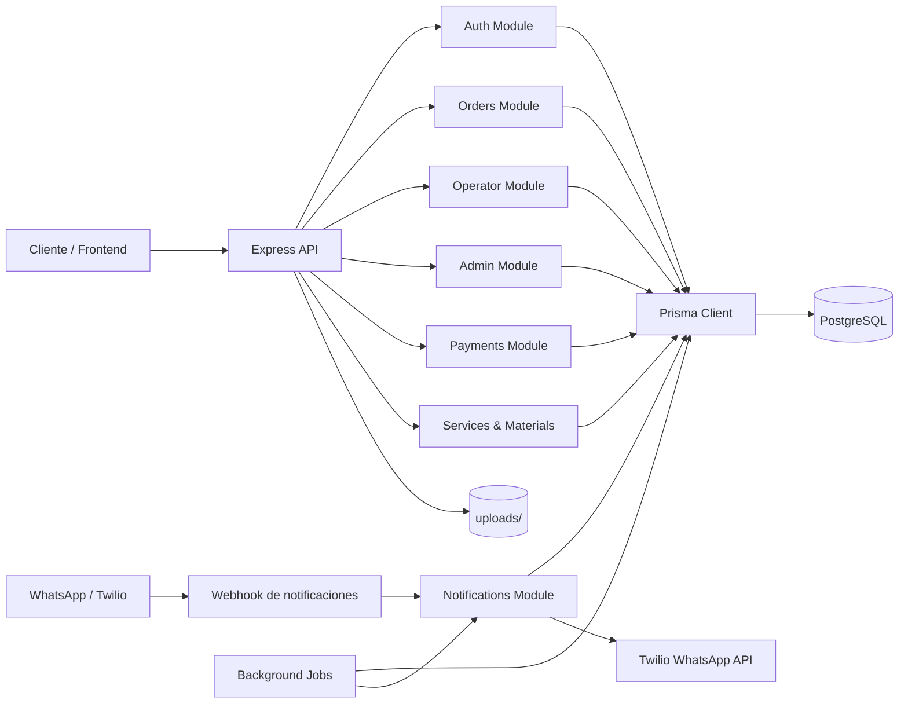
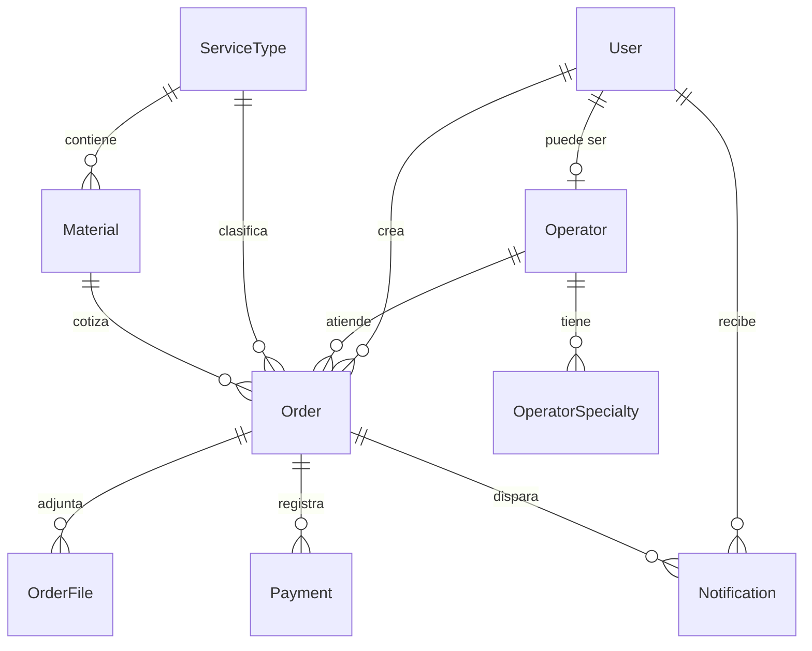
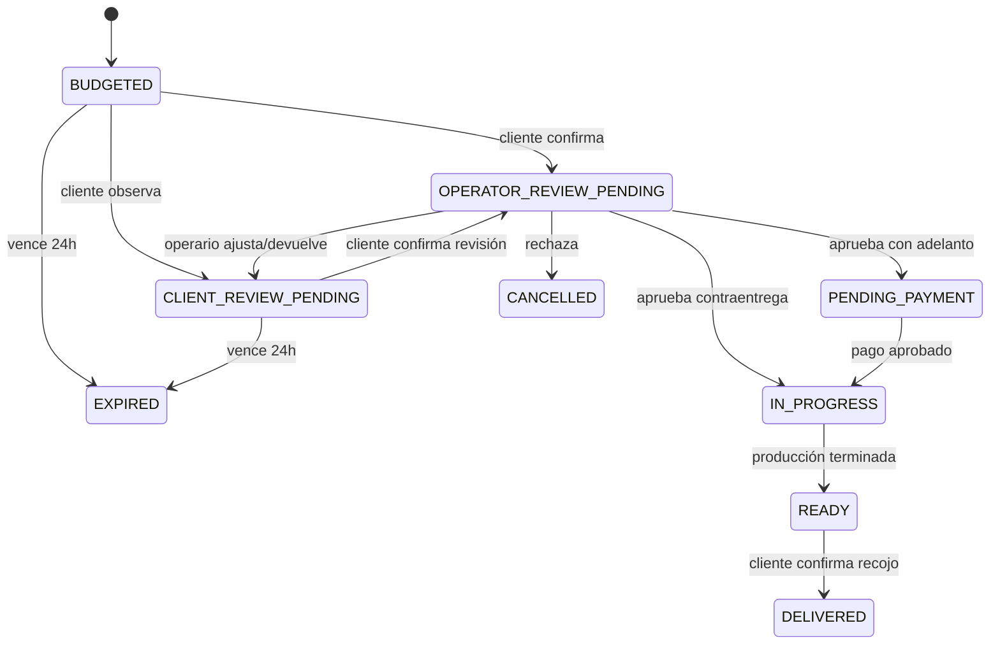

# SIGEPED Backend

> API backend para SIGEPED, el sistema de gestión de pedidos de ESIAD Proyectos. Centraliza autenticación, presupuestos, flujo de producción, pagos, reportes administrativos y notificaciones por WhatsApp.


**Tecnologías principales:** Node.js, Express 5, TypeScript, Prisma ORM, PostgreSQL, JWT, bcrypt, Multer, Twilio WhatsApp, Swagger/OpenAPI, Jest.

---

## Tabla de Contenidos

- [Descripción General](#descripción-general)
- [Características](#características)
- [Arquitectura](#arquitectura)
- [Stack Tecnológico](#stack-tecnológico)
- [Estructura del Proyecto](#estructura-del-proyecto)
- [Primeros Pasos](#primeros-pasos)
- [Ejecución](#ejecución)
- [API Overview](#api-overview)
- [Seguridad](#seguridad)
- [Base de Datos](#base-de-datos)
- [Flujo de Pedido](#flujo-de-pedido)
- [Decisiones de Diseño](#decisiones-de-diseño)
- [Escalabilidad](#escalabilidad)
- [Performance](#performance)
- [Testing](#testing)
- [Despliegue](#despliegue)
- [Screenshots](#screenshots)
- [Roadmap](#roadmap)
- [Contribución](#contribución)
- [Licencia](#licencia)

---

## Descripción General

SIGEPED Backend es una API REST modular para administrar pedidos de servicios técnicos como corte láser, ploteo, impresión 3D y maquetas. El sistema modela un flujo real de negocio: cliente registra un pedido, el backend calcula un presupuesto, asigna un operario por especialidad, gestiona revisión técnica, valida pagos, actualiza producción y notifica eventos relevantes por WhatsApp.

El proyecto está organizado por dominios, con controladores, servicios, rutas, middlewares y persistencia desacoplados. La documentación OpenAPI se expone desde la propia aplicación y el modelo relacional se mantiene con Prisma y migraciones versionadas.

> [!NOTE]
> Este repositorio contiene el backend. El frontend no forma parte del código incluido, aunque la API usa `FRONTEND_URL` para construir enlaces en mensajes de WhatsApp.

---

## Características

### Backend

- Autenticación con JWT usando DNI o teléfono como identificador.
- Registro de clientes con contraseñas hasheadas mediante `bcrypt`.
- Autorización por roles: `CLIENT`, `OPERATOR` y `ADMIN`.
- Catálogo administrable de servicios y materiales.
- Cálculo automático de presupuestos según modelo de precio:
  - `FIXED`
  - `PER_M2`
  - `PER_UNIT`
  - `PER_VOLUME`
- Asignación automática de operario activo por especialidad.
- Flujo de revisión cliente-operario con observaciones, ajustes de precio y aprobación técnica.
- Gestión de pagos con carga de captura y validación administrativa.
- Carga protegida de planos `.dwg`, `.dxf` y `.pdf`.
- Carga de comprobantes `.jpg`, `.jpeg` y `.png`.
- Descarga protegida de archivos para cliente propietario u operario asignado.
- Reportes administrativos en formato Excel mediante `xlsx`.
- Estadísticas de ventas, servicios, clientes, operarios y pedidos por estado.
- Jobs automáticos para expiración de presupuestos y recordatorios de recojo.
- Notificaciones por WhatsApp con Twilio y registro de estado de entrega.
- Documentación Swagger disponible en `/api/docs`.
- Healthcheck con validación de conexión a PostgreSQL.
- Manejo centralizado de errores con respuestas JSON consistentes.
- Logging HTTP con `morgan` y enriquecimiento de request/response.

### Frontend

Actualmente no implementado en este repositorio.

### Infraestructura

- Migraciones versionadas con Prisma.
- Seed sintético para poblar usuarios, servicios, materiales, pedidos, pagos y notificaciones.
- Variables de entorno documentadas en `.env.example`.
- Docker: actualmente no implementado.
- CI/CD: actualmente no implementado.

---

## Arquitectura

El backend sigue una arquitectura modular por dominio. Cada módulo encapsula rutas HTTP, controladores y servicios de negocio, mientras que los middlewares transversales se concentran en `src/middlewares`.



### Capas

| Capa | Responsabilidad |
| --- | --- |
| `routes` | Define endpoints, middlewares por ruta y restricciones de rol. |
| `controllers` | Traduce requests HTTP a llamadas de servicio y estandariza respuestas. |
| `services` | Contiene reglas de negocio, transacciones, validaciones y coordinación entre módulos. |
| `middlewares` | Autenticación, autorización, carga de archivos, logging y errores. |
| `config` | Configuración de entorno, Prisma y conexión PostgreSQL. |
| `jobs` | Procesos periódicos para vencimiento de presupuestos y recordatorios. |
| `prisma` | Esquema, migraciones y datos iniciales. |

### Patrones Utilizados

- **Arquitectura modular por dominio:** `auth`, `orders`, `operators`, `admin`, `payments`, `notifications`, `services` y `materials`.
- **Service Layer:** la lógica de negocio vive en servicios reutilizables y testeables.
- **Middleware Pipeline:** Express compone seguridad, parsing, logging y errores de forma transversal.
- **RBAC:** autorización por roles mediante `requireRole`.
- **Repository vía Prisma Client:** acceso a datos centralizado a través del cliente Prisma.
- **Transacciones:** cambios críticos como entrega de pedidos, aprobación de pagos y creación de operarios se ejecutan con `$transaction`.
- **Soft activation:** servicios, materiales y operarios pueden desactivarse sin ser eliminados del modelo operativo.

---

## Stack Tecnológico

| Capa | Tecnología | Propósito |
| --- | --- | --- |
| Runtime | Node.js | Ejecución del backend. |
| Lenguaje | TypeScript strict | Tipado estático y mantenibilidad. |
| Framework HTTP | Express 5 | API REST y middlewares. |
| ORM | Prisma 7 | Modelado, consultas y migraciones. |
| Base de datos | PostgreSQL | Persistencia relacional. |
| Driver DB | `pg` + `@prisma/adapter-pg` | Conexión Prisma/PostgreSQL. |
| Auth | JWT + bcrypt | Tokens Bearer y hash de contraseñas. |
| Seguridad HTTP | Helmet + CORS | Headers seguros y configuración cross-origin. |
| Uploads | Multer | Carga de planos y comprobantes. |
| Notificaciones | Twilio | Mensajes WhatsApp transaccionales. |
| Jobs | `setInterval` + `node-cron` | Tareas periódicas. |
| Documentación | Swagger UI + OpenAPI | Documentación interactiva de API. |
| Reportes | `xlsx` | Exportación de reportes administrativos. |
| Testing | Jest + ts-jest + Supertest | Pruebas unitarias e integración HTTP. |
| Desarrollo | ts-node-dev | Recarga automática en local. |

---

## Estructura del Proyecto

```text
.
├── prisma/
│   ├── migrations/
│   ├── schema.prisma
│   └── seed.ts
├── src/
│   ├── config/
│   ├── docs/
│   ├── jobs/
│   ├── middlewares/
│   ├── modules/
│   ├── utils/
│   └── app.ts
├── uploads/
├── .env.example
├── jest.config.js
├── package.json
├── prisma.config.ts
└── tsconfig.json
```

| Ruta | Responsabilidad |
| --- | --- |
| `src/app.ts` | Crea la aplicación Express, registra middlewares, monta módulos, expone Swagger y arranca jobs. |
| `src/config/env.ts` | Centraliza variables de entorno con defaults operativos. |
| `src/config/database.ts` | Configura `PrismaClient` con `PrismaPg` y valida conexión. |
| `src/modules/auth` | Registro, login, emisión de JWT y ocultamiento de `password_hash`. |
| `src/modules/orders` | Creación, presupuesto, revisión, archivos, observaciones y recojo de pedidos. |
| `src/modules/operators` | Cola de trabajo, revisión técnica, ajustes de precio, producción y descarga de planos. |
| `src/modules/admin` | Pagos, operadores, clientes, asignación manual, estadísticas y exportaciones Excel. |
| `src/modules/payments` | Registro de capturas de pago por clientes. |
| `src/modules/services` | CRUD administrativo del catálogo de servicios. |
| `src/modules/materials` | CRUD administrativo de materiales por servicio. |
| `src/modules/notifications` | Envío WhatsApp, webhook y chatbot básico de bienvenida. |
| `src/middlewares` | JWT, roles, uploads, logging y manejo de errores. |
| `src/jobs` | Expiración de presupuestos y recordatorio de pedidos listos por más de 48 horas. |
| `src/docs/openapi.ts` | Especificación OpenAPI expuesta por `/api/openapi.json` y `/api/docs`. |
| `src/utils` | Utilidades de cálculo de adelantos, fechas estimadas y mapeo servicio-especialidad. |
| `prisma/schema.prisma` | Modelo relacional, enums, relaciones y constraints. |
| `prisma/seed.ts` | Datos sintéticos para probar dashboard, roles, pedidos y reportes. |

---

## Primeros Pasos

### Requisitos

- Node.js 22 LTS recomendado.
- PostgreSQL disponible local o remoto.
- npm.

### Instalación

```bash
npm install
```

### Variables de Entorno

Copia el archivo de ejemplo:

```bash
cp .env.example .env
```

Configura los valores:

| Variable | Requerida | Uso |
| --- | --- | --- |
| `DATABASE_URL` | Sí | Cadena de conexión PostgreSQL. |
| `PORT` | No | Puerto HTTP. Default: `3000`. |
| `NODE_ENV` | No | Entorno de ejecución. Default: `development`. |
| `FRONTEND_URL` | No | Base URL usada en mensajes del bot. Default: `http://localhost:4200`. |
| `JWT_SECRET` | Sí | Clave para firmar/verificar JWT. |
| `JWT_EXPIRES_IN` | No | Duración del token. Default: `24h`. |
| `TWILIO_ACCOUNT_SID` | No | SID de Twilio para WhatsApp. |
| `TWILIO_AUTH_TOKEN` | No | Token de Twilio. |
| `TWILIO_WHATSAPP_FROM` | No | Remitente WhatsApp de Twilio. |
| `NGROK_URL` | No | URL pública para pruebas de webhook. |
| `UPLOAD_MAX_SIZE_MB` | No | Tamaño máximo de archivo. Default: `20`. |
| `UPLOAD_PATH` | No | Carpeta de uploads. Default: `./uploads`. |

### Base de Datos

Genera el cliente Prisma:

```bash
npx prisma generate
```

Ejecuta migraciones:

```bash
npx prisma migrate dev
```

Carga datos de prueba:

```bash
npx prisma db seed
```

Credenciales generadas por el seed:

| Rol | Identificador | Contraseña |
| --- | --- | --- |
| Admin | `00000000` | `sigeped123` |
| Operarios | `80000001`, `80000002`, `80000003` | `sigeped123` |
| Clientes | `70000001` a `70000006` | `sigeped123` |

---

## Ejecución

### Desarrollo

```bash
npm run dev
```

La API queda disponible en:

```text
http://localhost:3000
```

### Producción

Actualmente no existe script `build` ni script `start` en `package.json`. La compilación a `dist/` está preparada en `tsconfig.json`, pero el flujo de producción todavía no está automatizado.

### Docker

Actualmente no implementado.

### Scripts Disponibles

| Script | Comando | Descripción |
| --- | --- | --- |
| Desarrollo | `npm run dev` | Inicia `src/app.ts` con `ts-node-dev`. |
| Tests | `npm test` | Ejecuta Jest con `ts-jest`. |
| Prisma Generate | `npx prisma generate` | Genera Prisma Client. |
| Migraciones | `npx prisma migrate dev` | Aplica migraciones en desarrollo. |
| Seed | `npx prisma db seed` | Carga datos sintéticos. |
| Studio | `npx prisma studio` | Abre explorador visual de datos. |

---

## API Overview

La documentación interactiva está disponible cuando el servidor está corriendo:

```text
GET /api/docs
GET /api/openapi.json
```

### Convenciones

Respuestas exitosas:

```json
{
  "data": {}
}
```

Errores:

```json
{
  "error": true,
  "message": "Descripción del error"
}
```

Autenticación:

```http
Authorization: Bearer <jwt>
```

### Endpoints Principales

| Módulo | Método y Ruta | Rol | Propósito |
| --- | --- | --- | --- |
| Health | `GET /health` | Público | Verifica API y conexión a DB. |
| Auth | `POST /api/auth/register` | Público | Registra cliente. |
| Auth | `POST /api/auth/login` | Público | Inicia sesión y devuelve JWT. |
| Services | `GET /api/services` | Público/Admin | Lista servicios activos; admin puede incluir inactivos. |
| Services | `POST /api/services` | Admin | Crea servicio. |
| Services | `PATCH /api/services/:id` | Admin | Actualiza servicio. |
| Services | `PATCH /api/services/:id/toggle` | Admin | Activa/desactiva servicio. |
| Services | `DELETE /api/services/:id` | Admin | Elimina servicio si no tiene restricciones. |
| Materials | `GET /api/materials` | Público | Lista materiales; admite filtro por servicio. |
| Materials | `POST /api/materials` | Admin | Crea material. |
| Materials | `PATCH /api/materials/:id` | Admin | Actualiza material. |
| Materials | `PATCH /api/materials/:id/toggle` | Admin | Activa/desactiva material. |
| Materials | `DELETE /api/materials/:id` | Admin | Elimina material si no tiene restricciones. |
| Orders | `POST /api/orders` | Cliente | Crea pedido y presupuesto. |
| Orders | `GET /api/orders/my` | Cliente | Lista pedidos propios. |
| Orders | `GET /api/orders/:id` | Cliente | Obtiene detalle de pedido propio. |
| Orders | `POST /api/orders/:id/files` | Cliente | Sube plano del pedido. |
| Orders | `POST /api/orders/:id/confirm` | Cliente | Confirma presupuesto. |
| Orders | `POST /api/orders/:id/confirm-review` | Cliente | Confirma revisión del cliente. |
| Orders | `POST /api/orders/:id/observations` | Cliente | Envía observaciones. |
| Orders | `POST /api/orders/:id/confirm-pickup` | Cliente | Confirma recojo y cierra pedido. |
| Orders | `GET /api/orders/:id/file` | Cliente | Descarga archivo principal protegido. |
| Orders | `GET /api/orders/:id/files/:fileId/download` | Cliente | Descarga archivo específico protegido. |
| Operator | `GET /api/operator/orders` | Operario | Lista pedidos asignados. |
| Operator | `GET /api/operator/orders/:id` | Operario | Consulta detalle de pedido asignado. |
| Operator | `PATCH /api/operator/orders/:id/status` | Operario | Cambia estado a `IN_PROGRESS` o `READY`. |
| Operator | `POST /api/operator/orders/:id/review` | Operario | Aprueba, devuelve o rechaza revisión técnica. |
| Operator | `PATCH /api/operator/orders/:id/price` | Operario | Ajusta precio final con motivo. |
| Operator | `PATCH /api/operator/orders/:id/production-time` | Operario | Registra tiempo estimado de producción. |
| Operator | `PATCH /api/operator/orders/:id/notes` | Operario | Agrega notas internas. |
| Operator | `GET /api/operator/orders/:id/file` | Operario | Descarga archivo principal de pedido asignado. |
| Operator | `GET /api/operator/orders/:id/files/:fileId/download` | Operario | Descarga archivo específico de pedido asignado. |
| Payments | `POST /api/payments` | Cliente | Sube captura de adelanto. |
| Admin | `GET /api/admin/payments/pending` | Admin | Lista pagos pendientes. |
| Admin | `PATCH /api/admin/payments/:id/approve` | Admin | Aprueba pago e inicia producción. |
| Admin | `PATCH /api/admin/payments/:id/reject` | Admin | Rechaza pago con comentario. |
| Admin | `PATCH /api/admin/orders/:id/assign` | Admin | Asigna operario manualmente. |
| Admin | `GET /api/admin/orders` | Admin | Lista pedidos con filtros. |
| Admin | `GET /api/admin/clients` | Admin | Lista clientes. |
| Admin | `GET /api/admin/operators` | Admin | Lista operarios. |
| Admin | `POST /api/admin/operators` | Admin | Crea operario. |
| Admin | `PATCH /api/admin/operators/:id` | Admin | Actualiza operario. |
| Admin | `PATCH /api/admin/operators/:id/toggle` | Admin | Activa/desactiva operario. |
| Admin | `DELETE /api/admin/operators/:id` | Admin | Elimina operario sin pedidos activos. |
| Admin | `GET /api/admin/stats/*` | Admin | Estadísticas administrativas. |
| Admin | `GET /api/admin/reports/*/export` | Admin | Exportaciones Excel. |
| Notifications | `POST /api/notifications/webhook` | Twilio | Webhook de mensajes entrantes. |

---

## Seguridad

| Control | Implementación |
| --- | --- |
| Hashing de contraseñas | `bcrypt.hash(password, 10)` en registro y creación/edición de operarios. |
| JWT | Tokens firmados con `JWT_SECRET`, expiración configurable por `JWT_EXPIRES_IN`. |
| Bearer Auth | `authMiddleware` exige `Authorization: Bearer <token>`. |
| RBAC | `requireRole` restringe rutas por `CLIENT`, `OPERATOR` y `ADMIN`. |
| Headers HTTP | `helmet()` aplicado globalmente. |
| CORS | `cors()` aplicado globalmente. |
| Upload validation | Multer valida extensiones y tamaño máximo configurable. |
| File access control | Descargas validan propiedad del cliente u operario asignado. |
| Path traversal guard | Las descargas resuelven ruta absoluta y verifican que permanezca dentro de `UPLOAD_PATH`. |
| Respuestas seguras | `password_hash` se excluye de respuestas de autenticación. |
| Error handling | Errores conocidos se mapean a respuestas JSON; duplicados Prisma `P2002` devuelven `409`. |
| Rate limiting | Actualmente no implementado. |
| Cookies/Sessions | Actualmente no implementado; la autenticación es stateless con JWT. |
| Sanitización avanzada | Actualmente no implementada como middleware dedicado. |

---

## Base de Datos

El proyecto usa PostgreSQL con Prisma ORM. El esquema define enums de dominio, relaciones explícitas y constraints de unicidad para datos críticos como DNI, teléfono, nombre de servicio y material por servicio.



### Entidades Principales

| Modelo | Propósito |
| --- | --- |
| `User` | Usuarios del sistema con rol, DNI, teléfono, historial de pedidos completados y flag de cliente frecuente. |
| `Operator` | Extensión de usuario operario, con estado activo y relación con especialidades. |
| `OperatorSpecialty` | Pivot de especialidades: `LASER`, `PLOTTING`, `PRINTING_3D`, `MODEL`. |
| `ServiceType` | Catálogo de servicios y modelo de precio. |
| `Material` | Material por servicio, precio unitario y unidad de medición. |
| `Order` | Agregado central del negocio: estado, cliente, operario, servicio, material, precio, revisión y producción. |
| `OrderFile` | Planos cargados por pedido. |
| `Payment` | Comprobantes, monto, tipo y estado de revisión. |
| `Notification` | Historial de eventos enviados por WhatsApp. |

### Estados del Pedido



---

## Flujo de Pedido

1. El cliente crea un pedido con servicio, material y métricas requeridas por el modelo de precio.
2. El backend valida catálogo activo y calcula `estimated_price`.
3. Se determina condición de pago:
   - Cliente nuevo: `ADVANCE_50`.
   - Cliente frecuente: `CASH_ON_DELIVERY`.
4. Se calcula `advance_amount` cuando aplica.
5. Se asigna un operario activo cuya especialidad coincide con el modelo de precio.
6. El presupuesto queda en `BUDGETED` con expiración a 24 horas.
7. El cliente confirma o envía observaciones.
8. El operario aprueba, devuelve al cliente, rechaza o ajusta precio.
9. Si requiere adelanto, el pedido pasa a `PENDING_PAYMENT`.
10. El cliente sube captura de pago y el admin la aprueba o rechaza.
11. Producción avanza a `IN_PROGRESS`, luego `READY`.
12. El cliente confirma recojo y el pedido queda `DELIVERED`.
13. Al llegar a 5 pedidos completados, el cliente se marca como frecuente.

---

## Decisiones de Diseño

- **Prisma con PostgreSQL:** favorece consistencia relacional, migraciones auditables y un modelo de dominio claro.
- **Roles explícitos:** reduce ambigüedad operativa entre cliente, operario y administrador.
- **Modelo de precio por enum:** permite extender servicios sin duplicar lógica de cotización.
- **Especialidad derivada del pricing model:** conecta el catálogo con la asignación operativa de taller.
- **Transacciones en cambios críticos:** evita estados parciales en pagos, entrega de pedidos y gestión de operarios.
- **WhatsApp desacoplado:** si Twilio no está configurado, el sistema no rompe el flujo principal; registra fallo cuando corresponde.
- **Archivos fuera de DB:** almacena rutas de archivos en PostgreSQL y mantiene binarios en `uploads/`.
- **OpenAPI en código:** la documentación vive cerca de la API y se publica automáticamente con el servidor.

---

## Escalabilidad

El diseño actual permite evolucionar de forma incremental:

- Separar jobs a workers dedicados usando una cola como BullMQ o RabbitMQ.
- Reemplazar almacenamiento local `uploads/` por S3, Cloud Storage o equivalente.
- Agregar rate limiting y auditoría persistente para endpoints sensibles.
- Incorporar paginación en listados administrativos y de operario.
- Mover notificaciones a un módulo asíncrono con reintentos.
- Añadir índices específicos según métricas reales de consulta.
- Separar módulos en paquetes o servicios si el dominio crece.

---

## Performance

Optimizaciones ya presentes:

- Uso de `select` e `include` específicos para limitar datos devueltos en vistas de operario y admin.
- Ordenamiento de cola operativa por fecha estimada y creación.
- Expiración de presupuestos por `updateMany`, evitando procesar registros uno por uno.
- Validación temprana de archivos antes de entrar a controladores.
- Healthcheck liviano con `SELECT 1`.
- ETag deshabilitado en desarrollo para evitar respuestas `304` durante pruebas locales.

Actualmente no hay caché, paginación global ni métricas APM implementadas.

---

## Testing

El proyecto usa Jest con `ts-jest` y archivos `*.spec.ts`.

```bash
npm test
```

Pruebas presentes:

| Archivo | Cobertura |
| --- | --- |
| `src/utils/order.utils.spec.ts` | Cálculo de adelanto, fecha estimada y mapeo a especialidad. |
| `src/modules/orders/orders.service.spec.ts` | Reglas de negocio del servicio de pedidos. |
| `src/modules/auth/auth.controller.spec.ts` | Comportamiento del controlador de autenticación. |

> [!IMPORTANT]
> La cobertura no está configurada como reporte en `package.json`. El comando actual ejecuta la suite, pero no publica métricas de cobertura.

---

## Despliegue

Actualmente no hay configuración Docker, pipeline CI/CD ni script de producción automatizado.

Para preparar despliegue se recomienda:

1. Agregar script `build` con `tsc`.
2. Agregar script `start` apuntando a `dist/src/app.js`.
3. Ejecutar `npx prisma migrate deploy` en el entorno productivo.
4. Configurar `DATABASE_URL`, `JWT_SECRET`, `TWILIO_*`, `UPLOAD_PATH` y `FRONTEND_URL`.
5. Persistir uploads fuera del filesystem efímero si se despliega en PaaS.
6. Activar logs estructurados y monitoreo.

---

## Screenshots

Actualmente no hay screenshots ni GIFs incluidos en el repositorio.

La API puede inspeccionarse desde Swagger:

```text
http://localhost:3000/api/docs
```

---

## Roadmap

- [x] API REST modular por dominio.
- [x] Autenticación JWT y autorización por roles.
- [x] Modelo relacional con Prisma y PostgreSQL.
- [x] Flujo de pedido con revisión cliente-operario.
- [x] Carga y descarga protegida de archivos.
- [x] Gestión de pagos y validación administrativa.
- [x] Notificaciones WhatsApp con Twilio.
- [x] Jobs para expiración y recordatorios.
- [x] Reportes administrativos en Excel.
- [x] Documentación OpenAPI.
- [ ] Script de build/start para producción.
- [ ] Dockerfile y docker-compose.
- [ ] CI/CD con ejecución de tests y migraciones.
- [ ] Rate limiting.
- [ ] Paginación y filtros avanzados en listados.
- [ ] Almacenamiento de archivos en servicio externo.
- [ ] Cobertura de tests automatizada.

---

## Contribución

1. Crea una rama descriptiva desde la rama principal.
2. Mantén los cambios acotados a un dominio o caso de uso.
3. Agrega o actualiza pruebas cuando cambies reglas de negocio.
4. Ejecuta `npm test` antes de abrir un PR.
5. Documenta nuevas variables de entorno en `.env.example`.
6. Si agregas endpoints, actualiza `src/docs/openapi.ts`.
7. Si modificas el modelo de datos, agrega una migración Prisma.

---

## Licencia

El paquete declara licencia `ISC` en `package.json`.

---

## Referencias del Proyecto

- Contrato de API: `API_CONTRACT.md`
- Modelo de base de datos: `DATABASE.md`
- Guía de logging: `LOGGING_GUIDE.md`
- Chatbot y WhatsApp: `CHATBOT.md`
- Flujo de revisión de pedidos: `PLAN_FLUJO_PEDIDOS_REVISION.md`
